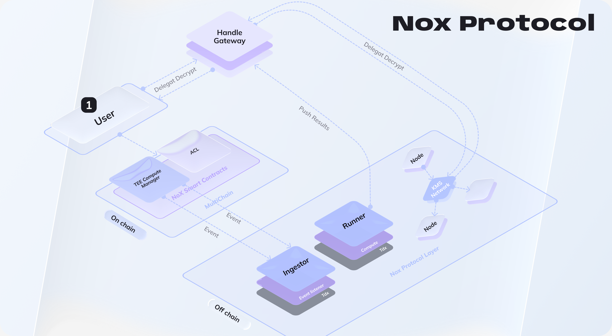

# Nox - Confidential Protocol

> **Nox** is a **trustless, multichain confidential execution protocol for DeFi** — with **programmable auditability**.

  

Nox Protocol builds the first truly on-chain composable privacy layer for DeFi, multichain, multi-privacy. Gas-efficient confidential computation at blockchain speed: like HTTPS made secure connections invisible, Nox makes privacy the default.
Seamless for users, effortless for builders who can develop and monetize their own confidential functions, auditable for regulators.

## 🔐 How Nox Works

- Smart contracts manipulate **handles** instead of plaintext values — ciphertexts never appear in the clear on-chain
- Confidential computations run inside **Runners (attested TEEs)**, ensuring data remains encrypted even during processing
- A **distributed KMS** powered by **threshold ECIES** and **Shamir secret sharing** splits decryption keys across multiple nodes — no single party can decrypt data alone
- Decryption is **delegated to the client**: each KMS node computes a partial re-encryption share, reassembled client-side, so the KMS never sees plaintext
- **On-chain ACLs** make permissions explicit, auditable, and revocable — enabling programmable auditability and selective disclosure

## 💡 What You Can Build With Nox

- Yield with Confidential Vault
- cRWA with confidential Tokenized Equity on-chain
- Confidential value transfers
- Privacy-preserving DeFi primitives
- Tokens with hidden balances & amounts
- Selective disclosure workflows (audit, compliance)
- Institutional-grade DeFi & RWAs

## ⚡ Product Quick Start - Confidential Token

> The **Confidential Token** is the first Nox-based product: an **ERC-7984 (OpenZeppelin)**-compliant confidential ERC-20.
> It showcases the Nox protocol in action — no need to understand the full stack to get started.

With the Confidential Token, you can:

- **Create** a native confidential token (cToken)
- **Shield / Unshield** — wrap an existing ERC-20 into a cToken and unwrap it back
- **Swap** cTokens (ERC-7984 to ERC-7984) with fully encrypted amounts
- **Transfer** with hidden balances and amounts
- **Grant viewing permissions** via on-chain ACL for selective disclosure

## 💻 Dev Tools

> Developer tooling to interact with the Nox protocol and its products.

| Tool                 | Description                                                     |
| -------------------- | --------------------------------------------------------------- |
| Nox Solidity Library | Interfaces and helpers to interact with confidential primitives |
| Nox JS SDK           | Encrypt inputs, request confidential compute, decrypt outputs   |
| Examples & Starters  | Reference integrations and demos                                |

## 🔗 Useful Links

| Link | Description                              |
| ---- | ---------------------------------------- |
| Docs | Protocol concepts, guides, SDK reference |
